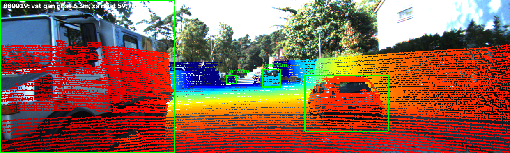
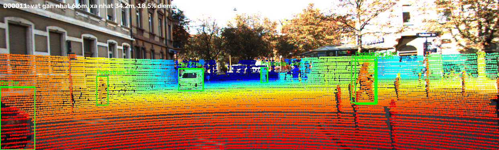
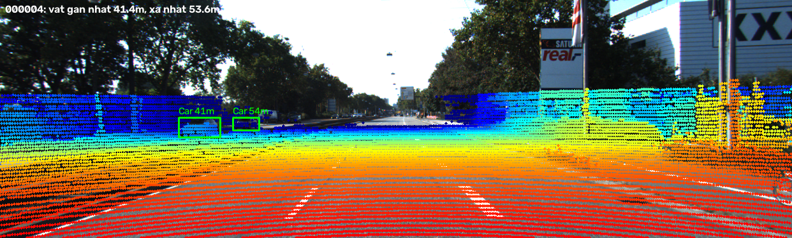
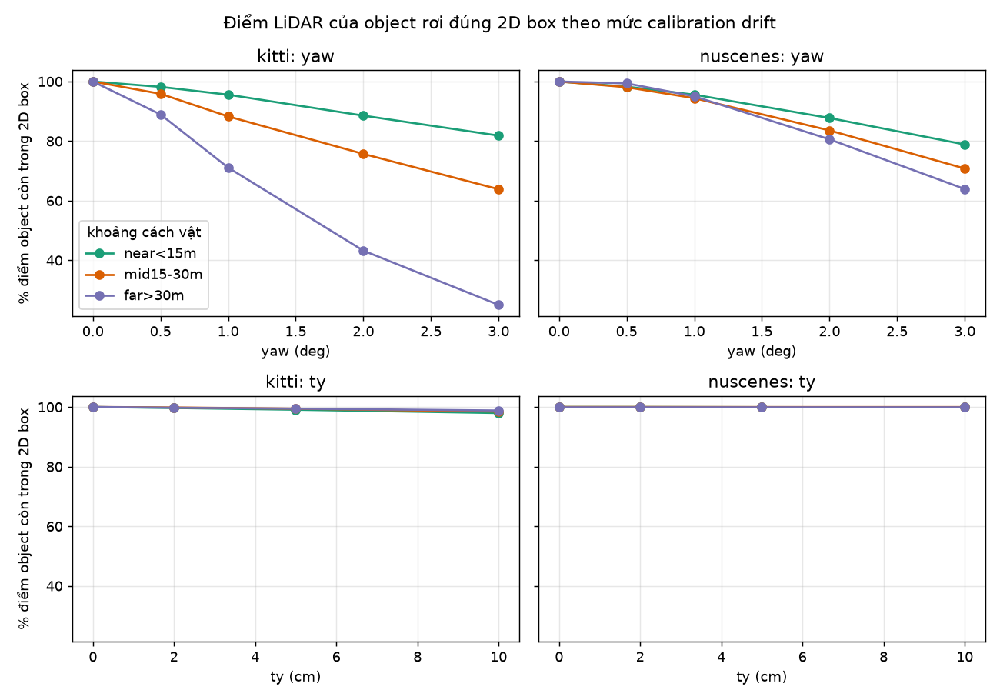
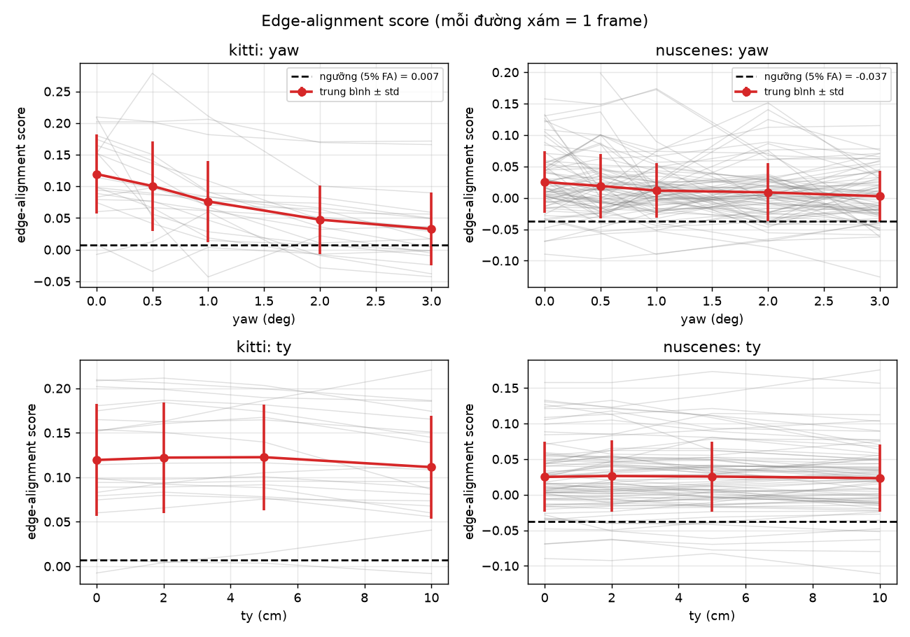
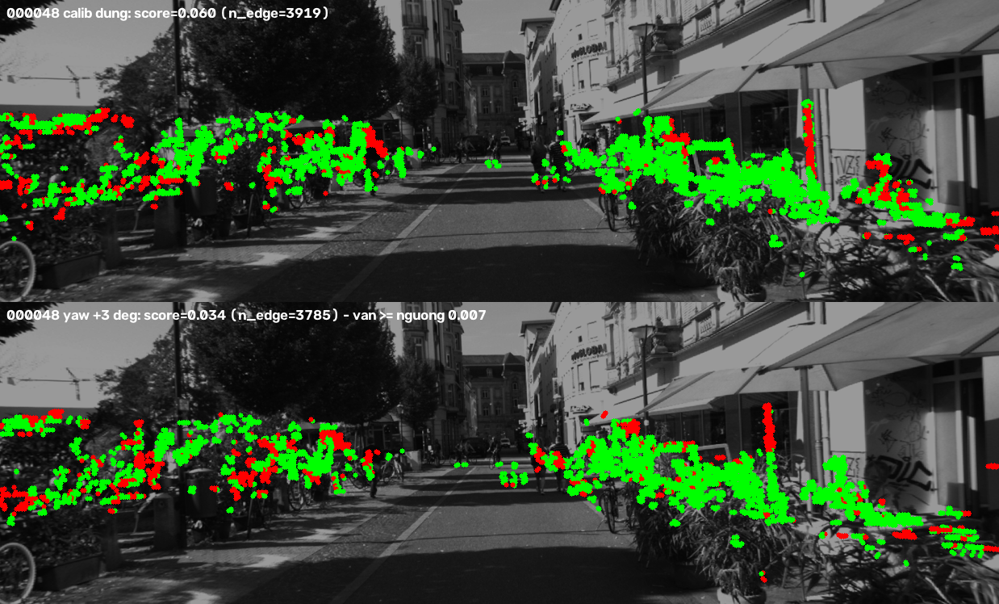
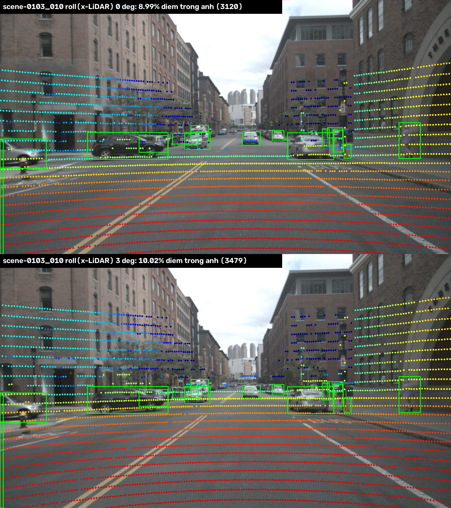
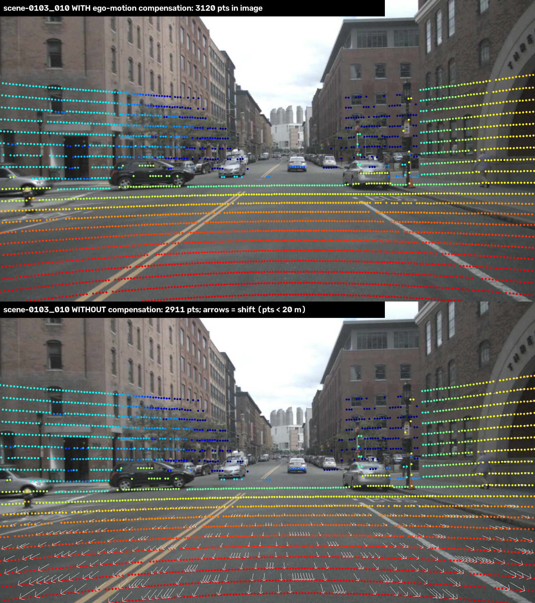
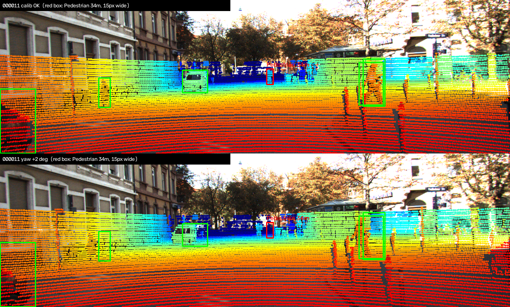

# Báo cáo Day 6: LiDAR-camera projection QA, calibration drift bao nhiêu thì phát hiện được?

- **Họ tên:** Nguyễn Văn Quốc Việt
- **MSSV:** 2A202602973
- **Lớp:** AI20K-T4
- **Link repo:** https://github.com/vietvuivui/NguyenVanQuocViet-2A202602973-Track4-Day21
- **Topic:** A — LiDAR-camera projection QA (mức Basic + Good + Advanced)
- **Dataset:** data/kitti_mini, data/nuscenes_mini_subset (và data/synthetic để debug)
- **Các frame đã dùng:** toàn bộ 20 frame KITTI (000001 … 000061) và 80 frame nuScenes (scene-0103_000 … scene-1094_039). Ảnh demo: 000019, 000011, 000004 (KITTI), scene-0103_010 (nuScenes)

## 1. Claim

*Tóm tắt thí nghiệm: đo % điểm LiDAR của object còn trong 2D box, trên 20 frame KITTI và 80 frame nuScenes, với các mức yaw/pitch/roll 0.5–3° và tịnh tiến 2–10 cm, chia theo khoảng cách vật (<15 m, 15–30 m, >30 m).*

Lệch **yaw 1°** làm điểm LiDAR của vật **xa hơn 30 m** mất 29% khả năng rơi vào 2D box (còn 71%), trong khi vật gần hơn 15 m chỉ mất 4% (KITTI), còn lệch tịnh tiến đến **10 cm** gần như không đổi gì (≥ 97% điểm vẫn trong box). Một edge-alignment score tự giám sát (không cần label) có phát hiện được drift, nhưng **chỉ ở mức yếu**: với ngưỡng cho phép 5% báo nhầm, nó phát hiện 10% frame ở yaw 1° và 40% frame ở yaw 3° trên KITTI, và gần như không phát hiện được gì trên nuScenes (LiDAR 32 beam).

## 2. Evidence

Mọi số liệu dưới đây được sinh bởi `python -m src.run_topic_a all` (xem mục 5), không có phần ngẫu nhiên. Chạy lại 2 lần cho cùng hash CSV. `box hit` là % điểm LiDAR thuộc object (nằm trong 3D box GT và chiếu gốc vào 2D box) vẫn nằm trong 2D box sau khi perturb, nên baseline = 100% theo định nghĩa. KITTI: 108 object (36 xa, 40 vừa, 32 gần). nuScenes: 300 object (35 xa, 180 vừa, 85 gần). Mỗi lần perturb chỉ đổi **một** trục, giữ nguyên các trục khác.

**Bảng 1 — KITTI (20 frame), % điểm còn trong 2D box theo khoảng cách vật** (`results/calib_sweep_summary.csv`)

| Perturb | % điểm trong ảnh | box hit gần <15 m | box hit vừa 15–30 m | box hit xa >30 m | dịch pixel (vừa) | score (TB) | % frame phát hiện (FA 5%) |
|---|---|---|---|---|---|---|---|
| không (baseline) | 15.75 | 100 | 100 | 100 | 0 | 0.119 | 5.0 |
| yaw 0.5° | 15.76 | 98.2 | 95.9 | 88.9 | 7.5 | 0.101 | 5.0 |
| yaw 1° | 15.76 | 95.6 | 88.3 | 71.1 | 14.9 | 0.076 | 10.0 |
| yaw 2° | 15.77 | 88.6 | 75.7 | 43.3 | 29.8 | 0.047 | 20.0 |
| yaw 3° | 15.77 | 81.8 | 63.9 | 25.1 | 44.7 | 0.033 | 40.0 |
| pitch 1° | 15.02 | 90.6 | 85.8 | 62.6 | 12.8 | 0.050 | 25.0 |
| pitch 3° | 13.50 | 69.5 | 52.7 | 14.3 | 38.5 | 0.003 | 55.0 |
| roll 3° | 15.79 | 92.5 | 87.5 | 87.5 | 13.4 | 0.038 | 35.0 |
| tịnh tiến y 2 cm | 15.76 | 99.7 | 99.8 | 99.8 | 0.8 | 0.122 | 10.0 |
| tịnh tiến y 5 cm | 15.76 | 99.1 | 99.4 | 99.4 | 1.9 | 0.123 | 5.0 |
| tịnh tiến y 10 cm | 15.76 | 98.0 | 98.5 | 98.8 | 3.8 | 0.111 | 5.0 |
| tịnh tiến z 10 cm | 16.48 | 97.4 | 98.6 | 97.1 | 3.8 | 0.087 | 0.0 |

Đủ 6 trục (yaw, pitch, roll, tx, ty, tz) × các mức 0.5/1/2/3° và 2/5/10 cm có trong CSV.

**Bảng 2 — nuScenes (80 frame, LiDAR 32 beam, ảnh 1600×900)**

| Perturb | box hit gần | box hit vừa | box hit xa | dịch pixel (vừa) | % frame phát hiện (FA 5.1%) | số điểm biên TB (median) |
|---|---|---|---|---|---|---|
| không | 100 | 100 | 100 | 0 | 5.1 | 81 |
| yaw 1° | 95.6 | 94.4 | 95.0 | 26.0 | 10.1 | 81 |
| yaw 3° | 78.9 | 70.8 | 63.9 | 78.4 | 15.2 | 75 |
| trục x LiDAR 3° (= camera pitch) | 86.6 | 64.4 | 29.0 | 68.2 | 5.1 | — |
| tịnh tiến 10 cm (y) | 99.9 | 100 | 100 | 2.5 | 6.3 | — |

Nhận xét cho B5 (so sánh hai dataset): cùng 1° yaw, nuScenes dịch **26 px**, KITTI dịch **15 px**, vì tiêu cự nuScenes lớn hơn (ảnh 1600 px so với 1242 px), nhưng box hit của nuScenes lại giảm **chậm hơn** ở vật xa (95% so với 71%). Tôi **chưa kiểm chứng** nguyên nhân; giả thuyết hợp lý là 2D box nuScenes được sinh từ phép chiếu 3D box nên rộng hơn box KITTI vẽ tay. Ngoài ra trục `pitch`/`roll` của nuScenes bị hoán đổi so với KITTI, vì trục x của LiDAR nuScenes hướng sang phải (xem `data/README.md`): "roll" quanh x chính là camera pitch (22 px/° ở khoảng cách vừa, tương đương yaw), còn "pitch" quanh y (hướng trước) chỉ xoay ảnh quanh tâm. Score trên nuScenes không dùng được: median chỉ 81.5 điểm biên mỗi frame (KITTI 913.5), nên phát hiện chỉ 10–15%, sát mức báo nhầm 5%.

**Bảng 3 — Quét yaw trên 3 frame KITTI theo script mẫu của codelab** (`results/yaw_perturb_sweep.csv`; `hit_ratio` = % điểm trong 3D box GT rơi vào 2D box của label, tính cả điểm vốn đã lệch ở calib đúng nên mức sàn < 100%)

| yaw | 000008 (đông xe) | 000011 (nhiều người đi bộ) | 000049 (nhiều vật bị che) |
|---|---|---|---|
| 0° | 99.63% | 99.45% | 99.25% |
| 0.5° | 99.57% | 91.88% | 97.46% |
| 1° | 98.62% | 77.44% | 93.50% |
| 2° | 94.81% | 45.44% | 84.74% |
| 3° | 90.98% | 21.23% | 74.32% |

Frame nhiều người đi bộ (000011) giảm nhanh nhất: ở 1° tụt từ 99.5% xuống 77.4%, còn frame đông xe (000008) gần như không đổi (98.6%) vì xe rộng hơn người nhiều lần trên ảnh, nên cùng một độ dịch pixel vẫn nằm trong box. Số này khớp tuyệt đối bảng kỳ vọng của đề (sai lệch 0.0), nên cũng là phép kiểm chứng độc lập cho 2 hàm `velo_to_cam`, `cam_to_image` và cho metric ở Bảng 1 (cách tính khác: Bảng 1 chỉ giữ điểm vốn đã trong 2D box ở calib đúng nên baseline = 100%).








Ba ảnh demo là overlay chưa perturb ở ba khoảng cách (vật gần nhất 6.3 m, 6.6 m–34 m, và 41–54 m). Điểm LiDAR khớp xe, người, cột và mặt đường, không có điểm trên bầu trời. Chi tiết score: `score = aligned − chance`, với `aligned` là trung bình `exp(−d/2.5px)` của điểm biên-độ-sâu tới cạnh Canny gần nhất, `chance` là cùng đại lượng khi bản đồ cạnh bị dịch 6 offset cố định. Tôi trừ `chance` vì không trừ thì score phẳng (0.54 → 0.53 khi yaw 0 → 3°), do ảnh nhiều cạnh nên điểm lệch vẫn "trúng" cạnh ngẫu nhiên. Ngưỡng phát hiện = percentile 5 của score các frame sạch (KITTI 0.007, nuScenes −0.037).

So từng frame với chính nó khi sạch thì tín hiệu có thật: score giảm ở 85% frame KITTI khi yaw 1° và 100% khi yaw 2°. Điểm yếu là score tuyệt đối khác nhau giữa các cảnh nhiều hơn mức drift gây ra, nên ngưỡng toàn cục yếu. Điều này gợi ý lưu score baseline lúc calibrate cho từng cảnh/thiết bị.

## 3. Failure case

Bốn failure case, mỗi cái theo khung: trường hợp, quan sát, nguyên nhân, lớp debug, cách phát hiện khi chạy thật. Ảnh sinh bởi `python -m src.run_topic_a failures`.

### fail_01 — Metric: edge-alignment score không phát hiện yaw 3°



- **Trường hợp:** KITTI frame 000048 (cây, xe đạp, bụi cây dày), yaw +3°. 12/20 frame KITTI có score ở yaw 3° vẫn ≥ ngưỡng 0.007.
- **Quan sát:** score 0.060 (calib đúng) → 0.034 (yaw 3°), vẫn cao hơn ngưỡng; ở yaw 1° chỉ 10% frame bị phát hiện (báo nhầm 5%).
- **Nguyên nhân:** lá cây cho khoảng 3900 điểm "biên độ sâu" nhiễu (không phải biên vật thể) và ảnh đầy cạnh Canny, nên điểm lệch tới 45 px vẫn trúng cạnh khác. Cảnh ít biên rõ ràng (đường thẳng, vài xe) mới cho score nhạy.
- **Lớp debug:** Metric (kèm Preprocess: chọn điểm biên).
- **Cách phát hiện khi chạy thật:** chỉ tính score trên cảnh có đủ biên sạch (cột, mép xe), lưu score baseline lúc calibrate theo từng cảnh, và quyết định theo trung bình trượt nhiều frame (so từng frame với chính nó khi sạch thì score giảm ở 85% frame yaw 1°).

### fail_02 — Metric: "% điểm trong ảnh" tăng khi calibration xấu đi



- **Trường hợp:** nuScenes `scene-0103_010`, xoay LiDAR 3° quanh trục x của LiDAR (= camera pitch). Trên (calib đúng), dưới (lệch 3°).
- **Quan sát:** tỉ lệ điểm trong ảnh tăng 8.73% → 9.79% (trung bình 80 frame); KITTI tz 10 cm tăng 15.75% → 16.48%. Ở hình, toàn bộ vòng quét LiDAR dịch lên khoảng 68 px so với vật thể, nhưng số điểm trong ảnh lại tăng.
- **Nguyên nhân:** nhiều điểm hơn lọt vào khung hình ở mép trên so với số điểm rời khung ở mép dưới (tôi chưa tách riêng hai phần này). Metric chỉ đếm điểm, không so điểm với vật thể.
- **Lớp debug:** Metric.
- **Cách phát hiện khi chạy thật:** đừng dùng % inside-FOV làm chỉ số sức khoẻ calibration (hỏi: "nếu calibration sai hoàn toàn, metric có đổi không?"). Dùng hit rate theo box hoặc score dựa trên cạnh.

### fail_03 — Time: không bù chuyển động xe giữa lúc LiDAR và camera chụp



- **Trường hợp:** nuScenes `scene-0103_010`, chiếu LiDAR lên CAM_FRONT, tắt bù chuyển động (`--ignore-ego-motion`). Số liệu 80 frame: `results/nuscenes_ego_shift.csv`.
- **Quan sát:** số điểm vào ảnh giảm 3120 → 2911. Điểm dịch trung bình 9.9 px (scene-0103) và 12.0 px (scene-1094); điểm gần dưới 15 m dịch trung vị 13.6–15.1 px, còn điểm xa từ 30 m trở lên chỉ 2.2–4.7 px. Frame lệch nhiều nhất là `scene-1094_015` (22.4 px).
- **Nguyên nhân:** camera chụp sớm hơn LiDAR trung bình 35.6 ms (`timestamp_camera_us − timestamp_lidar_us`), xe tiến về phía trước trong khoảng đó nên điểm dịch toả ra từ điểm biến mất (mũi tên trong ảnh), lớn ở gần và nhỏ ở xa theo thị sai ∝ 1/độ sâu. Độ dịch trung bình tương đương khoảng 0.4–0.5° yaw (26 px/° ở nuScenes, Bảng 2).
- **Lớp debug:** Time.
- **Cách phát hiện khi chạy thật:** edge-alignment score **không phân biệt được** lỗi này (đổi −0.006, trong khi std giữa frame là 0.049–0.054; `results/nuscenes_ego_motion_ablation.csv`), nên phải theo dõi riêng độ lệch timestamp camera − LiDAR (cảnh báo khi vượt 40 ms hoặc dao động giữa các frame) và kiểm tra bù chuyển động còn bật, thay vì đoán từ chất lượng overlay.

### fail_04 — Geometry: vật hẹp và xa mất hết điểm khỏi 2D box khi lệch yaw



- **Trường hợp:** KITTI frame 000011, yaw +2°, 6 object có label (`results/yaw2_frame000011_objects.csv`).
- **Quan sát:** người ở 34.2 m và người ở 17.8 m mất **100%** điểm khỏi 2D box (hit 0%), người ở 13.4 m còn 28%, xe ở 6.6 m còn 39%, xe ở 27.1 m còn 61%.
- **Nguyên nhân:** yaw 2° dịch mọi điểm khoảng 25–44 px, bất kể khoảng cách. Người ở 34.2 m chỉ rộng **15 px** và người ở 17.8 m rộng 28 px, nhỏ hơn độ dịch nên điểm rơi hẳn ra ngoài. Xe ở 6.6 m rộng 86 px nhưng nằm sát mép ảnh bên trái, nên nhiều khả năng điểm bị dịch ra ngoài mép ảnh/box (chưa kiểm chứng riêng). Hit rate phụ thuộc vào độ rộng pixel của box chứ không phụ thuộc khoảng cách.
- **Lớp debug:** Geometry (extrinsic `Tr_velo_to_cam` sai góc).
- **Cách phát hiện khi chạy thật:** theo dõi hit rate **riêng cho các object nhỏ/xa** (rộng dưới 30 px), vì chúng báo động sớm nhất (yaw 0.5° đã làm vật xa mất 11%). Ngưỡng gợi ý: mức sàn thực tế của metric là 99.3–99.6%, cảnh báo khi trung bình trượt của nhóm vật xa tụt dưới 90%.

## 4. Khuyến nghị nếu triển khai thật

**Use-case:** xe giao hàng tự hành hoặc ADAS tốc độ thấp trong đô thị (dưới 30 km/h) dùng LiDAR + camera cho fusion. Câu hỏi "bracket lệch 1° sau va chạm nhẹ có tự phát hiện được không": **không đáng tin nếu chỉ dựa vào một frame**. Yaw 1° dịch điểm 15 px (KITTI) / 26 px (nuScenes) và làm vật xa hơn 30 m mất 29% điểm khỏi box (còn 71%), trong khi vật gần dưới 15 m chỉ mất 4%, nên fusion tầm xa hỏng trước mà quan sát gần vẫn trông ổn.

**Đánh đổi (đo trên CPU Intel, p50/p95 qua 30 lần, bỏ lần đầu, `results/latency_calib_check.csv`):** edge-alignment score tốn 18.3/22.9 ms (KITTI) và 13.4/15.5 ms (nuScenes), cộng 4.6 ms (KITTI) hoặc 14.1 ms (nuScenes) cho Canny + distance transform, tức khoảng 23–27 ms mỗi frame. Chạy mỗi 10 giây một frame thì chỉ tốn khoảng 0.25% một lõi, nhưng phát hiện chậm vài chục giây; chạy mỗi frame thì phát hiện nhanh mà tốn tài nguyên lúc xe đang cần tính toán cho detection. Hit rate theo box chỉ tốn 0.2 ms nhưng cần label hoặc detection ổn định (ví dụ xe đỗ), nên chỉ dùng được khi có detector 2D + 3D đồng thuận. Score không thay thế được hit rate: nó yếu (10% phát hiện ở yaw 1°) và gần như mù với nuScenes 32 beam.

**Chỉ số cần ghi log (đề xuất, chưa hiệu chỉnh trên dữ liệu thật):** (1) hit rate trung bình trượt của các detection **ở xa trên 30 m** mỗi phút: theo Bảng 1, yaw 0.5° đã kéo xuống 88.9% nên ngưỡng cảnh báo 90% trong 5 phút liên tục bắt được từ 0.5° ở KITTI, nhưng nuScenes ở 0.5° vẫn 99.4% nên ngưỡng phải đặt riêng theo từng bộ cảm biến; (2) score baseline lưu lúc calibrate và độ sụt của trung bình trượt so với baseline đó; (3) độ lệch timestamp camera − LiDAR (cảnh báo khi vượt 40 ms; ở nuScenes là 35.6 ms); (4) nhiệt độ và IMU của giá đỡ cảm biến để phân biệt lệch do va chạm với giãn nở nhiệt. Không dùng % điểm trong ảnh làm chỉ số (xem fail_02).

## 5. Cách chạy lại

Tạo môi trường (trên Windows cần `PYTHONUTF8=1` vì `requirements.txt` có chữ tiếng Việt), chạy từ thư mục gốc của repo. Toàn bộ khoảng 2–3 phút trên CPU.

```bash
python -m venv .venv
# Windows PowerShell:  .venv\Scripts\activate      macOS/Linux:  source .venv/bin/activate
export PYTHONUTF8=1      # PowerShell: $env:PYTHONUTF8="1"
pip install -r requirements.txt
python tools/verify_data.py --data-root data/kitti_mini
python tools/verify_data.py --data-root data/nuscenes_mini_subset
python -m src.test_projection
python -m starter.projection --data-root data/kitti_mini --frame 000011
python -m starter.projection --data-root data/nuscenes_mini_subset --frame scene-0103_010
python -m src.exp_yaw_sweep --data-root data/kitti_mini --frames 000008 000011 000049
python -m src.plot_yaw_sweep
python -m src.run_topic_a all      # demo + sweep + plots + failures (xem --help để chạy từng bước)
python -m src.latency_topic_a --runs 30   # latency p50/p95 (phụ thuộc CPU nên số ms sẽ khác máy bạn)
python tools/check_submission.py
```

Kết quả: `results/calib_sweep_summary.csv`, `results/calib_sweep_frames.csv`, `results/calib_sweep_boxes.csv`, `results/nuscenes_ego_motion_ablation.csv`, `results/nuscenes_ego_shift.csv`, `results/yaw2_frame000011_objects.csv`, `results/yaw_perturb_sweep.csv`, `results/latency_calib_check.csv` và các ảnh trong `results/figures/`. Code: `src/align_metrics.py` (metric), `src/run_topic_a.py` (thí nghiệm, có tham số dòng lệnh và `--help`), và 2 hàm `velo_to_cam`, `cam_to_image` trong `starter/projection.py`.

## 6. Khai báo sử dụng AI

| Công cụ | Dùng cho việc gì | Bạn đã kiểm chứng thế nào |
|---|---|---|
| Claude Code (Claude Sonnet 5.5) | Viết 2 hàm TODO trong `starter/projection.py`, viết `src/align_metrics.py` và `src/run_topic_a.py`, chạy thí nghiệm, soạn nháp báo cáo này, chẩn đoán lỗi cài đặt pip (`UnicodeDecodeError` do `requirements.txt`) | Điểm velodyne (10, 0, 0) cho z_cam = 9.73 (đúng kỳ vọng ≈ 10); đã xem ảnh overlay trên synthetic/KITTI/nuScenes, điểm khớp xe/người/mặt đường; chạy lại `sweep` + `plots` cho cùng hash CSV; số trong báo cáo đối chiếu trực tiếp với `results/calib_sweep_summary.csv`; score ban đầu phẳng đã được sửa bằng cách trừ `chance` và ghi lại trong mục 2 |
| Script mẫu của codelab Day 6 (không phải AI) | `src/exp_yaw_sweep.py`, `src/plot_yaw_sweep.py`, `src/test_projection.py` lấy từ hướng dẫn của đề làm điểm xuất phát | Số `hit_ratio` khớp bảng kỳ vọng của đề (sai lệch 0.0); chạy lại 2 lần cho file giống hệt. Phần mở rộng (6 trục, tách khoảng cách, nuScenes, score) nằm ở `src/run_topic_a.py` |
